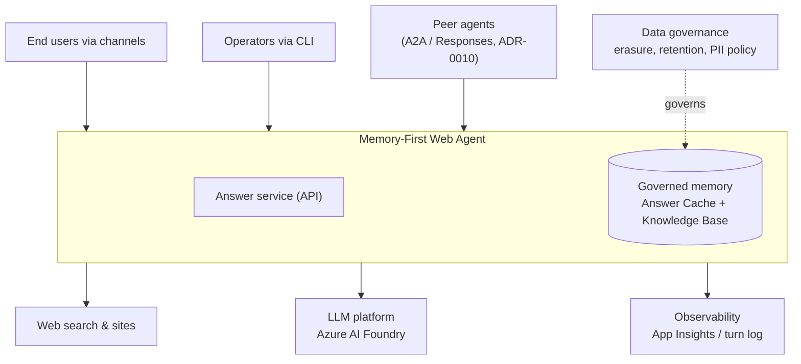
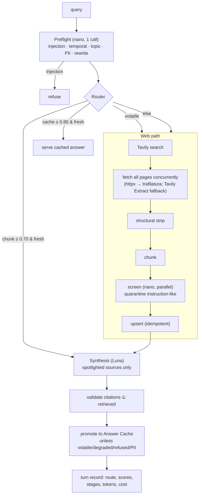
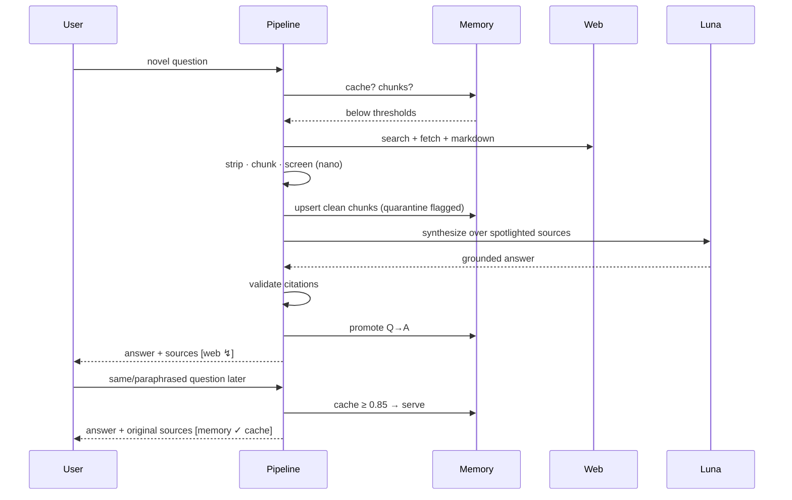

# Solution Architecture Document

Views follow C4 levels plus deployment and quality-attribute views. The canonical
vocabulary is [`CONTEXT.md`](../CONTEXT.md); decisions are recorded in [`docs/adr/`](adr/).

## 1. Context view

The agent is a knowledge service sitting between consumers and the open web, with its
own governed memory. In an enterprise landscape it occupies the "grounded assistant"
slot: identity fronts it, observability watches it, and its memory is a governed data
store with erasure obligations — not an opaque cache.

## 2. Container view

| Container | Tech | Responsibility |
|---|---|---|
| Hosted agent | agent-framework Responses host | Cloud entrypoint (Foundry Agent Service): platform-managed sessions and transport over the same Pipeline (ADR-0009) |
| Agent API | FastAPI / uvicorn | Local dev/admin HTTP surface: `/chat`, `/analytics/summary`, `/healthz`; auth, rate limit, sessions |
| CLI | Typer | Local entrypoint + **all** admin verbs (memory stats/cleanup/erasure) |
| Pipeline | plain-async Python | The memory-first routing (spec §4.2) — the architecture lives here |
| Memory | Redis 8 (vector) | Two tiers: `qa_cache` (Answer Cache), `chunks` (Knowledge Base) |
| LLM services | Agent Framework + OpenAI SDK | Conversation (Luna) and utility (nano) roles |
| Web acquisition | Tavily + httpx + trafilatura | Search, resilient fetch, markdown conversion |

## 3. Component view — one turn

## 4. Sequence — the two defining paths

**Miss → hit (the product loop):**

**Degradation (search down):** borderline memory (0.55–0.70) is served with an explicit
staleness caveat and never cached; with nothing relevant, the agent refuses honestly
(ADR-0008).

## 5. Deployment view

**Local**: docker-compose (`redis:8` with AOF) + CLI/uvicorn on the host. **Azure**: one
azd environment — a Foundry Hosted Agent (per-session VM-isolated sandboxes, Entra
Agent ID, code zip with remote build, ADR-0009), Azure Managed Redis B0 (TLS,
RediSearch), Foundry account + project with three model deployments, Key Vault (secret
source of truth, read at deploy time into the agent version's env), App Insights + Log
Analytics wired to the Foundry portal's Traces/Monitor/Evaluation views. CI/CD: GitHub
Actions — CI (lint, tests, evals, `bicep build`) on every push; CD on main via OIDC
federation: `azd provision` → Key Vault → `azd deploy` (azure.ai.agents extension) →
smoke invoke.

## 6. Quality-attribute scenarios

| # | Attribute | Scenario (stimulus → response) | Measure | Status |
|---|---|---|---|---|
| QA1 | Latency | Repeat question → served from Answer Cache | p50 ≤ 1s target; ~1–3s measured (preflight-bound) | ⚠ partial — preflight floor; roadmap item |
| QA2 | Latency | Novel question → full web path | p50 ≤ 10s, p95 ≤ 15s; 8–15s measured | ✅ |
| QA3 | Cost | 50% hit rate at 1K turns/day | ~−47% vs plain web agent | ✅ modeled + measured per turn |
| QA4 | Groundedness | Any answered turn cites only retrieved URLs | subset invariant enforced in code; judge mean ≥ 4/5 (measured 4.12) | ✅ |
| QA5 | Injection resilience | Poisoned page ingested → future turns unaffected | red-team evals: quarantine + no poison in answers | ✅ |
| QA6 | Availability | Search API down → labeled degraded answer or honest refusal | zero silent-wrong-answer paths | ✅ |
| QA7 | Erasure | GDPR request for a URL/question | one CLI command, cascade across both tiers | ✅ |
| QA8 | Capacity | Load exceeds model quota | 429 backoff → explicit "at capacity"; hit rate divides demand | ✅ policy; quota headroom is operational |

## 7. NFR traceability

Every NFR row in the spec (§3) maps to a mechanism above and a test: security → guardrail
layers + `evals/test_injection.py`; reliability → ADR-0008 + degradation tests;
observability → `TurnRecord` + analytics tests; quality → citation invariant +
groundedness evals; cost → telemetry cost accounting + `docs/cost-model.md`; compliance →
PII gate + erasure verbs + `docs/security.md`; operability → docker-compose, azd, CI/CD.
