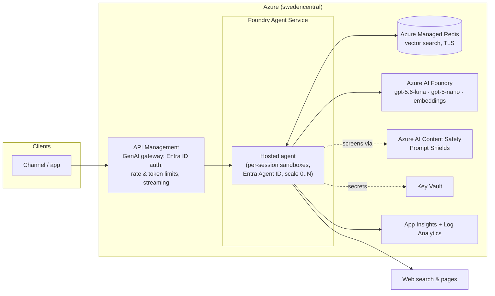

# Memory-First Agent — Reference Architecture Blueprint

This document generalizes the implementation into a reusable pattern: what stays the
same wherever it runs, what the production-grade Azure realization looks like, and what
changes on another cloud.

## The pattern

A memory-first agent inverts the usual RAG economics. A plain web-RAG agent pays the
full acquisition cost (search API + fetch + tokens) on **every** question; a memory-first
agent pays it **once per novel question**, then serves repeats and near-repeats from its
own store at ~1–10% of the cost and latency. The architecture is therefore three
invariant decisions, independent of any vendor:

1. **Two-tier memory, gated separately** — an Answer Cache (question↔question, symmetric,
   high threshold) over a Knowledge Base (question↔chunk, asymmetric, conservative
   threshold), because one similarity threshold cannot serve two geometries (ADR-0004).
2. **Freshness as routing, not storage** — entries never self-expire; a per-query
   temporal class decides what memory may serve (ADR-0006).
3. **Memory as a trust boundary** — content is screened before it may persist,
   quarantined rather than rewritten, and answers may only cite what was actually
   retrieved (`docs/security.md`).

## Production reference architecture (Azure)

Deltas from the implemented POC, in adoption order:

| Concern | POC (implemented) | Production |
|---|---|---|
| AuthN/AuthZ | Entra bearer on the platform agent endpoint | Same, plus APIM in front for external consumers (per-consumer quotas, OBO flows via Entra Agent ID) |
| Injection screening | nano classifier + deterministic patterns | Same, plus **Prompt Shields** at input and ingest — a managed, adversarially-maintained model |
| Gateway | none (direct ingress) | APIM GenAI gateway: token-rate policies, model failover, per-consumer quotas, response streaming |
| Network | public endpoints, TLS | Private endpoints + BYO virtual network for the agent runtime |
| Evaluation | CI evals + manual live groundedness | Foundry evaluations wired to nightly runs and release gates |
| Scale | per-session sandboxes (platform-scaled), one region | Same scaling model at higher quotas; Redis tier grows vertically; HNSW past ~50–100K chunks; single-flight collapsing |

Everything else — the routing logic, thresholds, guardrail layers, telemetry schema,
erasure verbs — ships unchanged: it is application code with no Azure dependency.

## Portability: what changes off Azure

The abstraction line was drawn deliberately: components speak OpenAI-compatible APIs and
standard Redis commands; only configuration binds them to Azure.

| Component | Azure (reference) | AWS | GCP | Change scope |
|---|---|---|---|---|
| Chat + utility models | Azure OpenAI (Foundry) | Bedrock | Vertex AI | Endpoint config; the agent-framework client abstracts the rest |
| Embeddings | Azure OpenAI | Bedrock Titan/Cohere | Vertex embeddings | Config + **threshold recalibration** (ADR-0004 — thresholds are model artifacts) |
| Vector memory | Azure Managed Redis | ElastiCache (Redis OSS 8) / MemoryDB | Memorystore Redis Cluster | None — Redis commands are the interface |
| Compute | Foundry Agent Service (hosted agent) | Bedrock AgentCore Runtime | Vertex AI Agent Engine | Hosting adapter (~150 lines); the pipeline itself is plain Python, and a Dockerfile path stays open for any container runtime |
| Secrets/identity | Key Vault + managed identity | Secrets Manager + IAM roles | Secret Manager + workload identity | IaC only |
| IaC | Bicep + azd | Terraform | Terraform | Rewrite (the one deliberate lock-in, ADR-0007) |
| Search + extraction | Tavily | Tavily | Tavily | None — cloud-neutral vendor |

The hardest component to port is nothing technical — it is the **threshold calibration**,
because similarity distributions shift with the embedding model. The eval suite is the
portability tool: re-run the routing golden set against the new embedder and re-place
the gates.

## Scaling narrative

At the documented design point (10K turns/day, 2–5 QPS peak) the first ceiling is model
quota, not infrastructure (spec §3.1): token demand scales with (1 − hit rate), so the
cache is the capacity plan. Past that: provisioned throughput for the conversation
model, Redis tier growth (vertical first — B0 → B5 covers 100× the corpus), HNSW at the
~50–100K chunk mark, and single-flight collapsing when concurrent identical misses stop
being rare. Multi-region is a data-governance decision before a technical one: memory
contains derived web content and cached answers only, so regional stores can rebuild
independently rather than replicate.
