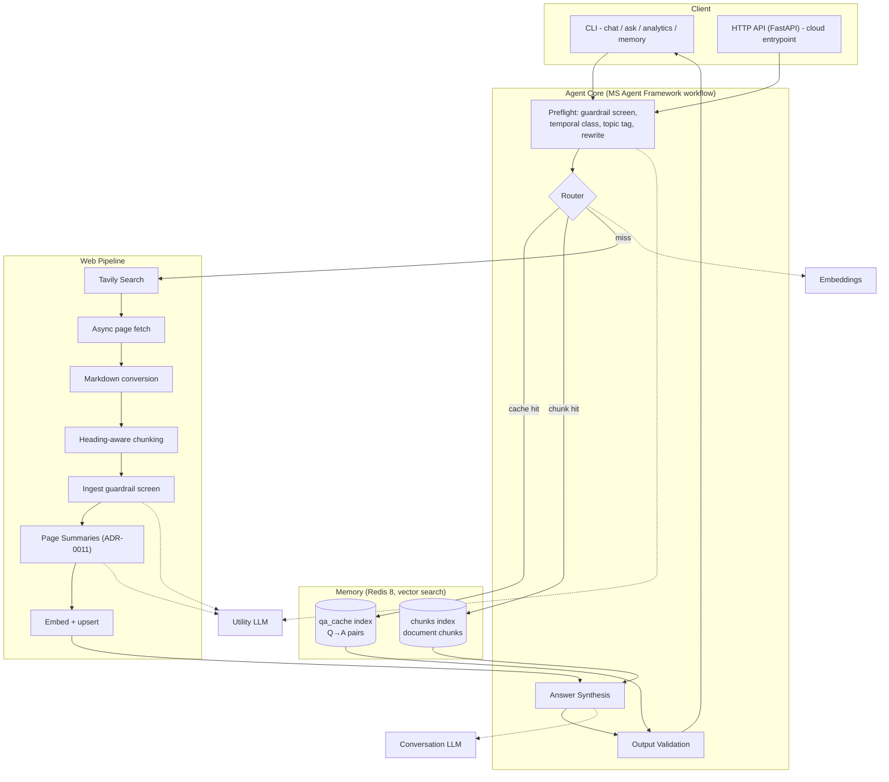

# Memory-First Web Agent — Design Specification

| | |
|---|---|
| **Status** | Implemented — maintained as the living design document |
| **Date** | 2026-08-07 (last updated 2026-08-10: ADR-0009 hosted target, ADR-0011 Page Summaries, Route/Temporal enums) |
| **Author** | Vadim Zhamkov |
| **Process** | Spec-first, AI-assisted workflow (see `docs/ai-assistance.md`) |

## 1. Overview

A GenAI agent that answers user questions **memory-first**: it checks a Redis vector memory before touching the web. On a miss it searches the web, fetches and converts pages to markdown, ingests them into memory, and answers from the retrieved context. Every answer is grounded and cites source URLs. Memory turns repeated and related questions from a multi-second, LLM-heavy web pipeline into a sub-second, low-cost retrieval — memory hit rate is the system's primary cost and latency lever.

## 2. Functional Requirements

FR-1. Embed the user query and perform vector search in Redis before any web access.
FR-2. If the top result similarity ≥ threshold (default **0.7**, configurable), answer from memory only, including stored metadata (source URLs, timestamps).
FR-3. On memory miss: search the web, fetch top result pages, convert them to **markdown**, summarize/chunk, store chunks + metadata in Redis, then answer from the retrieved context.
FR-4. Answers include clear metadata: the source URLs actually used.
FR-5. Two LLMs with distinct roles: a **conversation** model (answer synthesis) and a **utility/analytics** model (routing classification, guardrail screening, summarization, topic tagging). Choice justified by cost and quality (§6, ADR-0005).
FR-6. Log every turn: memory **hit** or **miss + web search**, with full turn telemetry (§10).
FR-7. Analytics on the topics and types of questions users ask (§10).
FR-8. Multi-turn conversation: a chat REPL with rolling history; queries are rewritten to standalone form before embedding.

## 3. Non-Functional Requirements

| NFR | Requirement | Design response |
|---|---|---|
| Security | Prompt-injection guardrails | Defense-in-depth, §8 |
| Reliability | Timeouts/retries for network and token issues | Per-stage budgets, idempotent retries, graceful degradation, §9 |
| Observability | Turn-level telemetry | Structured JSON logs, cost/latency per stage, §10 |
| Quality | Grounded, non-hallucinated answers | Citation validation + evaluation suite, §11 |
| Cost | Predictable per-turn economics | Model tiering + semantic caching, §6, `docs/cost-model.md` |
| Portability | No hard cloud lock-in | Provider-agnostic config; Azure primary, OpenAI-direct fallback; multi-cloud mapping in `docs/blueprint.md` |
| Compliance | GDPR alignment; operable within an ISO 27001 ISMS | Compliance by design, §8.6; `docs/security.md` |
| Operability | Runs locally for dev/test; deployed to Azure for production with CI/CD | docker-compose locally; azd-deployed Azure environment + GitHub Actions CI/CD, §14 |
| Performance | Hit p50 ≤ 1s; miss p50 ≤ 10s, p95 ≤ 15s | Concurrent fetching, streamed synthesis, low-reasoning models, §7/§9 |
| Availability | Best-effort (POC); 99.9% design target | Fast-fail 503 on Redis loss; HA path in `docs/blueprint.md`; §3.1 |
| Consistency | Bounded staleness, no strong-consistency requirement | Freshness-as-routing (§5.3); idempotent convergent writes; ADR-0002 |

### 3.1 Design point and scale envelope

- **POC validated at** ≤5 concurrent users / ~1 QPS.
- **Production design point**: 1K DAU × 10 turns/day ≈ 10K turns/day → ~0.12 QPS average, 2–5 QPS peak.
- **Storage**: ~10KB per chunk (6KB FLOAT32 vector + ~3KB text + metadata) → 100K chunks ≈ 1GB; Answer Cache the same order. The smallest Managed Redis tier covers the POC corpus by orders of magnitude.
- **Throughput ceiling**: at 5 QPS all-miss, ~6K tokens/turn ≈ **1.8M tokens/min against Azure OpenAI quota — the first limit to break**, well before compute or Redis. Effective TPM demand scales with (1 − hit rate): memory hit rate is a capacity lever, not only a cost lever. Mitigations: hit-rate growth, quota increase, provisioned throughput.
- **Consistency stance**: the system prioritizes availability with **bounded staleness** — answers may lag the live web within temporal-class TTLs *by design* (§5.3); no operation requires strong consistency; all memory writes are idempotent and convergent (content-hash keys), so retries and concurrent turns converge (ADR-0002).

## 4. Architecture

### 4.1 Components



### 4.2 Turn flow

1. **Preflight** (one utility-LLM call): injection screen on user input, temporal-intent class (`static` / `slow` / `volatile`), topic tag (fixed taxonomy + `other`), **PII flag** (`contains_pii`, §5.5), standalone query rewrite using conversation history.
2. **Route** — embed the standalone query, then:
   - `volatile` query → skip memory read, go to web (results still ingested).
   - **Tier 1 — semantic answer cache**: search `qa_cache` (question↔question, symmetric). Similarity ≥ `CACHE_THRESHOLD` (0.85) and fresh per §5.3 → return stored answer + sources. Log `hit_cache`.
   - **Tier 2 — chunk memory**: search `chunks` (question↔chunk, asymmetric). Top-1 ≥ `CHUNK_THRESHOLD` (0.70, the task default) and fresh → synthesize from top-k (k=5) chunks. Log `hit_chunks`.
   - **Miss** → web pipeline: Tavily search (top 5) → fetch pages concurrently → markdown → chunk → ingest screen → **Page Summary** per page from clean chunks only (utility LLM, ADR-0011) → embed/upsert chunks + summaries → synthesize from summaries and fresh chunks **plus** any borderline memory chunks (similarity 0.55–0.70). Log `miss_web`.

   **Promotion invariant**: every validated, fully grounded synthesis — chunk-tier or web-path — is written to the Answer Cache with its source URLs and timestamps, *unless* the turn is `volatile`, `degraded`, `refused`, or PII-flagged (§5.5, ADR-0001).
3. **Synthesize** (conversation LLM): answer strictly from provided context; retrieved content is wrapped as delimited untrusted data; every claim must be attributable; sources listed.
4. **Validate**: cited URLs must be a subset of retrieved URLs; guardrail verdicts attached; turn telemetry written.

### 4.3 Orchestration

Microsoft **Agent Framework** (Python, `agent-framework`) — workflow graph with executors for preflight, routing, web pipeline, and synthesis; Azure OpenAI chat clients. Rationale and the LangGraph trade-off: ADR-0003. Contingency: if the workflow API blocks progress, the same graph runs as a plain asyncio pipeline behind identical component interfaces, with Agent Framework retained for model access (noted in ADR-0003; component boundaries make the swap invisible to the rest of the system).

## 5. Memory Design

Ubiquitous language for this section and everywhere else: tier 1 is the **Answer Cache** (`qa_cache`), tier 2 the **Knowledge Base** (`chunks`) — canonical terms in `CONTEXT.md`.

### 5.1 Two tiers, two thresholds

Question↔question matching (Tier 1) is symmetric: paraphrases of the same question embed close together, so a high threshold (0.85) gives precise, near-free repeat answers. Question↔chunk matching (Tier 2) is asymmetric — questions and answer-bearing prose are different text types with systematically lower cosine similarity — so the gate stays at the task default 0.70, deliberately conservative: a redundant web search is cheaper than a misleading answer. Thresholds are per-index, per-embedding-model, configurable, and calibrated empirically (ADR-0004). Redis returns cosine *distance*; the memory layer normalizes to similarity in one place.

### 5.2 Indexes (Redis 8, RediSearch, FLAT, cosine, 1536 dims)

- `qa_cache`: question text + embedding → answer, source URLs, `topic`, `temporal_class`, `created_at`, `hit_count`, `last_hit_at`.
- `chunks`: chunk text + embedding → source URL, title, section, `content_sha256`, `fetched_at`, `ingest_flags` (guardrail verdicts), `hit_count`, `last_hit_at`. Page Summaries (ADR-0011) live in the same index with `section = "[page summary]"` and the page's provenance — a page-level retrieval target alongside the local chunks.

**FLAT, not HNSW**: at POC scale (≤ tens of thousands of vectors) exact search is faster in practice, has perfect recall, and zero build cost; the switch point (~50–100K vectors) and HNSW parameters are documented in ADR-0006.

**Why a KV/vector store and no RDBMS**: nothing here needs ACID — chunks are *re-fetchable derived data*, cache entries are *cache-semantic*, and the turn log (JSONL / App Insights) is *append-only* and is the actual system of record. Redis is also the task-designated store; both facts are recorded honestly in the ADR.

**Durability and HA stance (ADR-0002)**: memory is a **reconstructible cache**. Persistence is on (local: `--appendonly yes`, everysec; production: Managed Redis persistence), but RPO is deliberately relaxed — total memory loss degrades the system to a plain web agent that re-warms itself through normal use; correctness is never at stake, and there is no backfill problem. Single-node Redis is the accepted POC SPOF: when unreachable, the API fast-fails 503 via `/healthz` rather than hanging. Production posture: Managed Redis replication + ≥2 Container App replicas (`docs/blueprint.md`).

### 5.3 Freshness

Freshness is a **routing** concern, not a storage concern. Memory entries carry timestamps; the preflight temporal class decides validity at query time: `volatile` → never served from memory; `slow` → valid within `SLOW_TTL_DAYS` (7); `static` → no expiry. Answers surface source dates. Native Redis TTL is not used for vectors (too blunt); a `memory cleanup` command evicts stale/cold entries.

### 5.4 Deduplication and idempotency

- **URL level**: normalized URL (scheme/host lowercased, tracking params and fragments stripped) hashed; a URL fetched within its TTL is not re-ingested.
- **Content level**: `sha256(normalized_chunk_text)` is part of the Redis key → identical chunks upsert instead of duplicating, making ingestion idempotent and therefore safely retryable.

### 5.5 Memory content policy (ADR-0001)

**Invariant: shared memory contains only shareable knowledge.**

- **PII gate**: preflight sets `contains_pii`; flagged turns are answered normally but never written to the Answer Cache. The Knowledge Base is unaffected — web content is public by construction. On preflight parse failure the safe default is `contains_pii=true` (fail-closed toward the shared store).
- **Exclusions**: `volatile`, `degraded`, and `refused` turns never produce cache entries — a degraded answer would launder its caveat into a confident future answer; volatile entries would be dead weight no read path touches.
- **Promotion**: chunk-tier answers are promoted into the Answer Cache (inheriting chunk source URLs and timestamps), so the cache records *every* clean synthesis, not only web-path ones.
- **Erasure**: `forget --url` cascades through provenance (both tiers); `forget --question` erases cache entries by question key. Together they cover both doors personal data can enter (§8.6).
- **Turn-failure independence**: ingestion precedes synthesis; chunks ingested by a turn that later fails remain — memory state is valid independently of turn outcome, and idempotent upserts make retried turns converge. No rollback machinery.
- **Concurrency**: concurrent identical misses duplicate acquisition work; content-hash dedup collapses the writes. Accepted at the design point; single-flight collapsing is a roadmap item (§16).

## 6. Model Selection and Cost

All models served from one Azure AI Foundry resource; provider-agnostic env config allows an OpenAI-direct fallback with zero code change (ADR-0005).

| Role | Model | Why |
|---|---|---|
| Conversation | `gpt-5.6-luna` (low/no reasoning effort) | Newest generation (Jul 2026), GA in Foundry across all global regions. $0.20/$1.20 per 1M tokens — ~6–8× cheaper than `gpt-5.1` ($1.25/$10) while newer and faster (~190 tok/s); strong knowledge/low-hallucination scores; 1M context. Run at low reasoning effort for chat-grade latency. |
| Utility/analytics | `gpt-5-nano` | Preflight classification, injection screening, topic tagging are structurally simple tasks on the critical path of **every** turn — a small non-reasoning model minimizes time-to-first-token and costs $0.05/$0.40. Note `gpt-5-mini` is *not* cheaper than Luna ($0.25/$2 vs $0.20/$1.20), which rules it out of both roles. |
| Embeddings | `text-embedding-3-small` (1536) | `-large` is ~6.5× the cost for marginal gain at this scale. |

Model bindings are deployment-name environment config: swapping a model, or the provider itself (Azure ↔ OpenAI direct), requires no code change — that is the resilience mechanism, so no static fallback models are designated. `gpt-5.6-terra` is the documented quality-upgrade path (ADR-0005).

Considered and rejected: `gpt-5.6-sol` ($5/$30) — a frontier reasoning model for long-horizon agentic work; grounded synthesis from retrieved context does not use that depth, and reasoning-heavy decoding hurts chat latency. `gpt-5.6-terra` ($2/$12) — 10× Luna's price for marginal gain on this workload. `gpt-5.1` — dominated by Luna on price, speed, and recency at comparable quality (full comparison in ADR-0005).

Indicative per-turn economics (list prices, production rates):

| Component | Miss-path turn | Cache-hit turn |
|---|---|---|
| Tavily search (basic, 1 credit @ $0.008) | 0.8¢ | — |
| Tavily Extract fallback (~0.2 credits/page, occasional) | ~0–0.2¢ | — |
| Conversation LLM (Luna, ~5K in / 500 out) | ~0.16¢ | — |
| Utility LLM + embeddings | <0.02¢ | <0.02¢ |
| **Total** | **≈ 1¢** | **≈ 0.02¢** |

The search API — not the LLM — dominates miss-path cost by ~4–8×, which sharpens the business case: every memory hit avoids the single most expensive component entirely, making hit rate a ~50× cost multiplier between the paths. Full sensitivity analysis: `docs/cost-model.md`. Model availability and quota are verified at scaffold time; actually-deployed models are recorded in ADR-0005.

## 7. Web Acquisition Pipeline

- **Search**: Tavily API, top 5 results (metadata only — content acquisition is a separate, swappable stage).
- **Fetch**: behind a `ContentFetcher` interface with two implementations. **Primary**: `httpx` async + `trafilatura` markdown conversion — all results fetched concurrently, 10s per page; wall time is bounded by the slowest page, not the page count. **Fallback**: Tavily Extract (markdown format) for pages the direct fetch cannot serve — bot-protected or JS-rendered sites — invoked per-page on failure. Either implementation can be made primary via config. Per-page failures skip the page, never the turn; the turn proceeds once at least one page succeeds.
- Tavily **Map/Crawl** are deliberately not used: they serve whole-site ingestion (corpus seeding), not per-question acquisition.
- **Chunking**: heading-aware markdown splitting, target ~800 tokens, ~15% overlap; section title kept in metadata.
- **Ingest screen**: §8, layer 2.
- **Page Summaries** (ADR-0011): after the screen, the utility model condenses each page's clean chunks into a ≤120-word digest, stored in the Knowledge Base with the page's provenance and placed first in that page's synthesis context. Screening-then-summarizing is the ordering that keeps §8's classify-never-rewrite intact; a summary carrying injection markers is dropped, never repaired. A failed summary degrades to "no summary" and never fails the turn.

## 8. Security Design (prompt injection)

Threat model (details in `docs/security.md`): the highest-risk vector is **indirect** injection — instructions embedded in fetched web pages that would otherwise persist in memory and re-serve themselves ("memory poisoning"). Defense-in-depth; no single layer is trusted:

1. **Input screen** (preflight, utility LLM): direct-injection classification of user input.
2. **Ingest screen** (web path): structural stripping first (markdown conversion drops scripts; zero-width chars, HTML comments, base64 blobs removed), then the utility LLM **classifies** chunks for instruction-like content — classify-and-quarantine, never rewrite-and-trust (a sanitizer that rewrites poisoned text can itself be injected). Flagged chunks are stored quarantined (excluded from retrieval) with verdicts in metadata. The one rewriting step, the ingest Page Summary (ADR-0011), runs strictly after this screen on clean chunks only, and its output is dropped — never repaired — if it carries injection markers.
3. **Prompt architecture**: instruction hierarchy (system > user > data) plus spotlighting — retrieved content is delimited as untrusted data the model must treat as citable material, never as instructions. Hierarchy fine-tuning reduces injection success but does not eliminate it; it is one layer, not the control.
4. **Output validation**: citations must be a subset of actually-retrieved URLs (blocks fabricated sources); refusal template on guardrail trip.
5. **Least privilege**: the agent has no side-effecting tools retrieved content could trigger; the blast radius of a successful injection is a bad answer, which layers 4 and the evaluation suite (§11) are designed to catch.

Production hardening (Azure AI Content Safety Prompt Shields at layers 1–2): `docs/blueprint.md`.

### 8.6 Compliance by design (GDPR, ISO 27001)

**GDPR.** Personal data can enter through two doors: user queries (may contain PII) and ingested web content (third-party PII). Controls:

- **Data minimization**: no user identity is collected; turn logs store query text and telemetry only, keyed by opaque `turn_id`.
- **Storage limitation**: freshness TTLs (§5.3) and `memory cleanup` bound retention; retention defaults documented in `docs/security.md`.
- **Right to erasure by design**: every chunk carries provenance (source URL, content hash) and every cache entry records its source URLs, so `agent memory forget --url <URL>` cascades deletion through both indexes, and `agent memory forget --question "<text>"` erases Answer Cache entries by question key — erasure works *because* provenance metadata exists. This is a known hard problem in vector stores; the design solves it structurally rather than by full reindex. The PII gate (§5.5) minimizes what there is to erase in the first place.
- **Data residency**: Azure deployment pins an EU region (e.g., Sweden Central); Azure OpenAI processes in-geography via EU Data Zone deployments and does not train on customer data (Microsoft DPA applies).
- **Processor transparency**: search queries transit Tavily (third-party processor) — documented in `docs/security.md`; production alternative with EU processing noted in `docs/blueprint.md`. Lawful basis and DPIA are operator responsibilities; the repo documents the data flows they need.

**ISO 27001.** The standard certifies an organization's ISMS, not a piece of software — the correct claim is that the solution is designed to **operate within an ISO 27001-certified ISMS** and maps to Annex A controls: cryptographic controls (TLS in transit; encryption at rest on Azure; Redis TLS/AUTH in production), access control (Key Vault, managed identity, RBAC — no secrets in code or repo), logging and monitoring (turn telemetry, Application Insights), secure development (CI quality gates, dependency pinning, reviewed changes), and supplier security (Microsoft, OpenAI, and Tavily each hold ISO 27001 certification). The control mapping table lives in `docs/security.md`.

## 9. Reliability Design

Timeouts bound **failure detection**, not expected latency: each is sized ~3× the provider's typical p99 and tuned after first measurements. All values are config.

| Stage | Timeout | Typical latency | Retry policy |
|---|---|---|---|
| Tavily search | 5s | ~1–2s (basic depth) | 3× exponential backoff + jitter (idempotent) |
| Page fetch | 10s/page, all concurrent | 1–5s | 2× per page; failures skip the page |
| Embeddings | 10s | ~0.1–0.5s single, 1–2s batched | 3× backoff (idempotent) |
| Utility LLM (nano) | 15s | ~1s | 3× backoff on 429/5xx/transport only — never on "bad output" |
| Conversation LLM (streamed) | 30s total, 10s to first token | ~3–5s | same as utility |
| Redis ops | 2s | ~1–10ms | 2× backoff; writes idempotent via content-hash keys |

Degradation: if web search is unavailable on a miss, the agent serves the best below-threshold memory content **explicitly labeled** as potentially stale/incomplete, and refuses only when memory has nothing relevant (`DEGRADED_ANSWERS=true` default; strict-refusal available via config — ADR-0008). Model-quota exhaustion (429 storms) gets bounded backoff retries, then an explicit "at capacity" refusal — never silent quality degradation. Retries live in one decorator module (`tenacity`), not scattered.

## 10. Observability and Analytics

Every turn emits one structured JSON record (stdout + `logs/turns.jsonl`): `turn_id`, route (`hit_cache` | `hit_chunks` | `miss_web` | `degraded` | `refused` — a `StrEnum` in `agent/domain.py`, as is the temporal class), topic, temporal class, guardrail verdicts, top-k similarity scores, per-stage latencies, token usage and computed cost per model, cited URLs. Implemented with `structlog`; in the hosted deployment the same turns also surface as OpenTelemetry gen_ai spans in Application Insights (Foundry Traces/Monitor).

Analytics (FR-7): **online** — the preflight call tags every turn with a topic (10-class taxonomy + `other`); **offline** — `agent analytics` aggregates hit rate, cost, latency percentiles, and topic/intent distributions from the logs, and can cluster stored query embeddings to surface emergent topics inside `other`.

**Hit rate is defined as** `(hit_cache + hit_chunks) / answered turns`: `refused` turns are excluded from the denominator (they measure the guardrails, not the routing) and `degraded` counts as a miss.

Primary business metric: memory hit rate (the cost *and capacity* lever, §3.1). Primary paging metrics (production): error rate and p95 latency.

## 11. Evaluation Strategy

Offline suite in `evals/`, wired into CI:

1. **Routing tests** (deterministic, mocked embeddings/search): seeded memory, known queries → assert hit/miss decisions, threshold edges, volatile bypass, degradation path.
2. **Citation validity** (deterministic): answer URLs ⊆ retrieved URLs on every golden-set run.
3. **Groundedness** (LLM-as-judge, utility model; runs only when a key is present): faithfulness of answers to retrieved context on a live golden set.
4. **Injection red team**: fixture pages and queries with embedded attacks → assert screens flag/quarantine and the answer path stays clean.

Online complement (roadmap): thumbs up/down feedback building a human-reviewed dataset.

## 12. Interfaces

Two interfaces over the same `Pipeline`:

- **CLI** (local dev/test; Typer + Rich): `agent chat` (REPL), `agent ask "…"` (one-shot), `agent analytics [--cluster]`, `agent memory stats|cleanup|clear|forget --url <URL>` (the `forget` verb implements GDPR erasure, §8.6), `agent serve` (runs the API locally). Each answer shows the route badge (memory hit / web), sources with dates, and per-turn cost at `-v`.
- **HTTP API** (FastAPI; the production entrypoint in Azure): `POST /chat` `{message, session_id?}` → `{answer, route, sources, turn_id, session_id}`; `GET /analytics/summary`; `GET /healthz` (liveness: Redis ping) — protected by a static bearer key (`API_KEY`); full authn (Entra ID) is a blueprint roadmap item. Conversation history per `session_id` is kept in Redis (last 10 turns, 1h TTL); the CLI keeps history in-process.

**Abuse controls**: a Redis-backed token bucket per API key (default 30 req/min → 429) and a `MAX_QUERY_CHARS` input cap (default 2000) enforced at both entrypoints — a leaked key must not become a cost or quota incident. Admin verbs (`memory …`, erasure) are deliberately **CLI-only**, never exposed over HTTP: attack-surface minimization.

## 13. Configuration

`pydantic-settings`, `.env` (never committed; `.env.example` provided): Azure/OpenAI endpoint + key + deployment names, Tavily key, Redis URL, thresholds, TTLs, timeouts, `API_KEY`, `RATE_LIMIT_PER_MIN` (30), `MAX_QUERY_CHARS` (2000), feature flags (`DEGRADED_ANSWERS`). Provider switch = env change only. In Azure, the same settings arrive on the hosted-agent version's environment (values read from Key Vault at deploy time), and Azure OpenAI auth is keyless via managed identity (§14).

## 14. Infrastructure, IaC, CI

The system runs **locally for dev/test** and is **deployed to Azure for production**; both paths are first-class.

- **Local (dev/test)**: `docker-compose.yml` — `redis:8` + the agent container; `Dockerfile` (uv-based, multi-stage). One command: `docker compose up`. The CLI and `agent serve` run against local Redis with `.env` keys.
- **Production (Azure, deployed via azd)**: `azure.yaml` + `infra/main.bicep`; `azd up` provisions **and deploys**: a **Foundry Hosted Agent** (code-first zip with remote build, per-session sandbox isolation, Entra Agent ID — ADR-0009 superseded the originally planned Container Apps target at build time), Azure Managed Redis (Balanced B0, TLS, vector search), the Foundry account + project with the three model deployments, Log Analytics + Application Insights, Key Vault (secret source of truth, read at deploy time into the agent version's environment). In-cloud authentication is keyless via managed identity. Region: `swedencentral` (EU residency, §8.6).
- **CI/CD (GitHub Actions)**: **CI** on every push/PR — ruff (lint+format), pytest (unit + deterministic evals, Redis service container), `bicep build` validation. **CD** on `main` after CI passes — `azd provision` + `azd deploy` (azure.ai.agents extension) + A2A enablement + smoke invoke, authenticated via OIDC federated credentials (`azd pipeline config`; no long-lived cloud secrets in GitHub). Keyed live evals (groundedness) as a manual workflow. Terraform alternative discussed in ADR-0007.
- **Python 3.13** (`uv`-managed): newest release line verifiably supported by the full dependency chain (Agent Framework, trafilatura/lxml, redis-py). 3.14 is attempted at scaffold time — a one-line change under uv — and adopted if resolution and tests pass; an I/O-bound LLM workload gains nothing from 3.14's headline features, so it is not worth pre-interview risk (ADR-0007).

## 15. Repository Layout

Repository: `vadjs/memory-first-agent` (private GitHub).

```
├── CONTEXT.md            # ubiquitous-language glossary
├── src/agent/            # the installable `agent` package (src layout); config, memory, web, guardrails, pipeline, api, cli, telemetry
├── evals/                # golden set, fixtures, eval runners
├── tests/                # unit tests
├── infra/                # main.bicep + modules; azure.yaml at root
├── docs/
│   ├── SAD.md            # architecture views: context, C4, sequences, deployment, QA scenarios
│   ├── adr/              # ADR-0001..0011
│   ├── blueprint.md      # production reference architecture (Azure) + multi-cloud mapping
│   ├── assessment.md     # Well-Architected self-assessment + roadmap to production
│   ├── cost-model.md     # per-turn economics, hit-rate sensitivity, KPIs
│   ├── security.md       # threat model and guardrail design
│   ├── ai-assistance.md  # how AI assistance was used (task requirement)
│   └── superpowers/      # this spec + the implementation plan
├── docker-compose.yml, Dockerfile, azure.yaml
└── .github/workflows/    # ci.yml + deploy.yml
```

ADRs (`docs/adr/`, chronological): 0001 memory content policy · 0002 consistency & durability (both written at design time) · 0003 orchestration framework · 0004 two-tier memory & thresholds · 0005 model selection & cost · 0006 vector index, dedup & freshness · 0007 runtime & IaC choices · 0008 reliability & degradation policy (written at build time) · 0009 Foundry hosted variant · 0010 agent interoperability · 0011 ingest page summaries (written as the system evolved).

## 16. Out of Scope

Web UI; user auth/multi-tenancy beyond the static API key on the HTTP endpoint; fine-tuning; online feedback loop (roadmap); single-flight collapsing of concurrent identical misses (roadmap); Prompt Shields integration (production blueprint only).

## 17. Risks and Mitigations

| Risk | Mitigation |
|---|---|
| Model quota/availability limits on trial subscription | GPT-5.6 is GA in all global regions on Global Standard; quota verified at scaffold; config-level model swap if needed; ADR-0005 records deployed reality |
| Agent Framework workflow API friction | Thin orchestration layer; asyncio fallback behind same interfaces (§4.3) |
| Extraction failures on some sites | trafilatura → readability fallback; per-page skip (§9) |
| Tavily free-tier limits | ~1K credits/month ≫ demo needs; retries + clear error surfacing |
| Azure trial credit burn | Per-token model deployments; hosted-agent sandboxes deprovision when idle; the only always-on cost is Managed Redis Balanced B0 (~$0.5/day) — total projected spend well within credits |
| Cloud deployment friction on trial subscription (resource-provider registration, Managed Redis SKU availability, ~15 min provisioning) | `azd up` runs early (during implementation, not at the end); if Managed Redis is unavailable to the subscription, fallback is a `redis:8` container app for the demo environment, recorded honestly in ADR-0007 |

The subscription- and quota-related notes above are working context for this spec and the implementation plan only; they do not appear in the solution documentation (`README`, `docs/SAD.md`, `docs/blueprint.md`, etc.).
